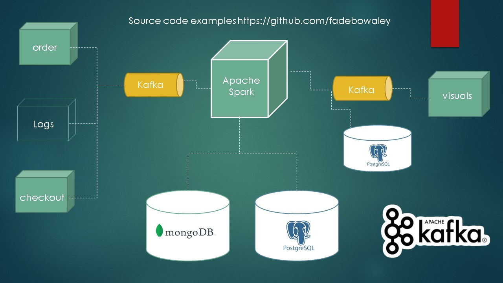

# Real-Time Data Pipeline Using Kafka and Spark

 - This project implements a real-time data pipeline for processing and analyzing sensor data using Apache Kafka and Apache Spark. The pipeline consists of three components: a data generator that generates sensor data, a Kafka producer that sends the data to a Kafka topic, and a Spark streaming application that consumes the data from the Kafka topic, processes it, and stores the results in a MongoDB database.

## Architecture

Architecture Diagram

The architecture of the real-time data pipeline consists of the following components:

## Data Generator: 
- A Flask web application that generates random sensor data and exposes it via a REST API.

## Kafka Producer: 
- A Python script that consumes the sensor data from the Flask web application and sends it to a Kafka topic.

## Kafka: 
- A distributed streaming platform that provides messaging, storage, and processing of real-time data streams.

## Spark Streaming Application: 
- A Python script that consumes the sensor data from the Kafka topic, processes it using Spark Streaming, and stores the results in a MongoDB database.

## MongoDB: 
- A NoSQL document database that stores the processed sensor data.

## Setup
- Install Apache Kafka and Apache Spark.

- Install Python packages using the requirements.txt file:

`pip install -r requirements.txt`

## Start the Kafka server and create a Kafka topic:

`bin/kafka-server-start.sh config/server.properties`

`bin/kafka-topics.sh --create --zookeeper localhost:2181 --replication-factor 1 --partitions 1 --topic RawSensorData`

## Start the Spark Streaming application:
`spark-submit --packages org.apache.spark:spark-streaming-kafka-0-8_2.11:2.4.7 process_store.py`

## Start the Flask web application:

`python start_api.py`
Verify that the processed sensor data is being stored in the MongoDB database.

# Future Improvements
- Add support for multiple Kafka topics and partitions to improve scalability.

- Implement a more advanced data validation and error handling system.

- Add a real-time visualization component to display the processed sensor data.

- Implement a machine learning model to predict future sensor data values based on historical data.

- Add support for real-time alerts and notifications based on specific sensor data thresholds.
